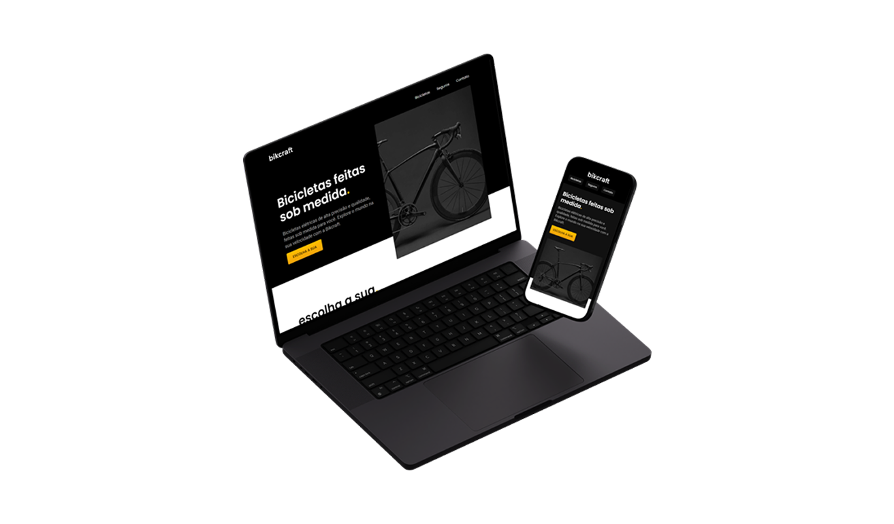

# 🚲 Bikcraft | Landing Page Responsiva

  

## 📌 Sobre o Projeto

O **Bikcraft** é um site institucional desenvolvido para uma empresa fictícia de bicicletas premium.  
O objetivo do projeto foi aplicar conceitos modernos de HTML semântico, CSS organizado e responsividade.

## 🛠 Tecnologias Utilizadas

  
  
  

## 🎨 Conceitos Aplicados

- Estruturação semântica
- Layout responsivo
- Organização modular de CSS
- Hierarquia visual
- Boas práticas de UI

## 📱 Responsividade

O projeto foi desenvolvido garantindo boa experiência em dispositivos móveis, tablets e desktops.

## 📊 Resultados Técnicos

- Performance otimizada
- Estrutura semântica validada
- Layout 100% responsivo
- Código organizado e modular
